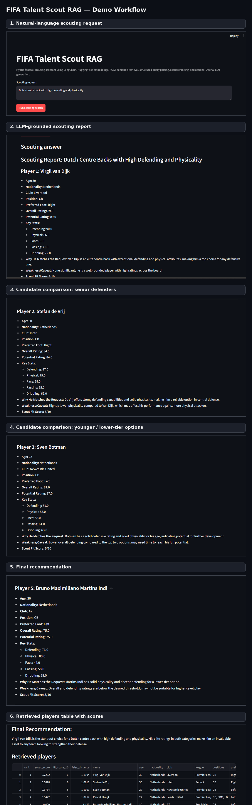

# FIFA Talent Scout RAG

A hybrid football scouting assistant that turns FIFA player data into searchable player profiles, retrieves relevant candidates from natural-language scouting requests, reranks them using football-specific criteria, and generates grounded scouting reports with an optional OpenAI LLM.

The project is designed as an AI Engineering portfolio project. It demonstrates structured query parsing, semantic retrieval, metadata filtering, custom reranking, prompt construction, and Streamlit-based inspection of the retrieval pipeline.

---

## Demo

Example query:

```text
Dutch centre back with high defending and physicality
```

The system parses the scouting request, retrieves Dutch centre-back candidates, reranks them using defending and physicality scores, and generates a scouting report with player strengths, weaknesses, fit scores, and a final recommendation.



---

## What This Project Does

The application helps answer scouting-style questions such as:

```text
French midfielder with high passing and potential
Brazilian winger under 23 with high pace and good potential
Young left-footed defender from Spain
Portuguese striker under 25 with strong shooting
Dutch centre back with high defending and physicality
Cheap young midfielder under 5 million with high potential
```

For each request, the system returns:

- a generated scouting report,
- retrieved player candidates,
- scout score and fit score,
- FAISS similarity distance,
- parsed scouting intent,
- retrieved context sent to the LLM,
- full prompt preview for debugging.

---

## Why This Is Not a Simple Chatbot

This project does not ask an LLM to search the database directly.

Instead, it follows a grounded retrieval pipeline:

```text
User query
↓
Structured query parser
↓
FAISS semantic retrieval
↓
Hard metadata filtering
↓
Football-specific scout reranking
↓
Top retrieved candidates
↓
Prompt construction
↓
Optional OpenAI LLM scouting report
↓
Streamlit UI with debug inspection
```

The LLM only receives the retrieved player profiles and the parsed query. It does not see the full CSV and is instructed not to invent players, clubs, ratings, values, nationalities, or statistics.

---

## System Architecture

```text
FIFA CSV dataset
↓
Pandas data loading
↓
One player row = one LangChain Document
↓
HuggingFace sentence-transformer embeddings
↓
FAISS vector index
↓
Natural-language scouting query
↓
Rule-based query parser
↓
FAISS semantic candidate retrieval
↓
Metadata filtering
↓
Scout score reranking
↓
OpenAI LLM grounded generation
↓
Streamlit interface
```

---

## Retrieval Design

### Chunking Strategy

Because the source data is a structured CSV, this project does not use normal text chunking such as `chunk_size=1000` and `chunk_overlap=200`.

Instead:

```text
1 player row = 1 document = 1 retrievable chunk
```

Each player profile is converted into a LangChain `Document` containing:

- name,
- age,
- nationality,
- club,
- league,
- positions,
- preferred foot,
- overall rating,
- potential rating,
- market value,
- wage,
- pace,
- shooting,
- passing,
- dribbling,
- defending,
- physicality.

This keeps each player profile complete and prevents the retriever from returning partial player records.

---

## Query Understanding

The project uses a structured query parser rather than relying only on vector similarity.

For example:

```text
Dutch centre back with high defending and physicality
```

is parsed into structured intent such as:

```json
{
  "nationality": "Netherlands",
  "positions": ["CB", "LCB", "RCB"],
  "min_defending": 75,
  "ranking_focus": ["defending"]
}
```

Another example:

```text
French midfielder with high passing and potential
```

is parsed as:

```json
{
  "nationality": "France",
  "positions": ["CAM", "CDM", "CM", "LM", "RM"],
  "min_passing": 75,
  "min_potential": 80,
  "ranking_focus": ["passing", "potential"]
}
```

This is important because vector search alone may understand the query semantically, but it does not guarantee strict handling of constraints such as nationality, age, position, preferred foot, or budget.

---

## Filtering and Reranking

The project separates constraints into two types.

### Hard Filters

Hard filters remove players that do not satisfy exact requirements:

- nationality,
- position group,
- maximum age,
- minimum age,
- preferred foot,
- maximum market value.

Example:

```text
Brazilian winger under 23
```

A player must be Brazilian, must match winger positions, and must be under 23.

### Soft Ranking Signals

Soft ranking signals do not automatically remove players. Instead, they increase or decrease the scout score:

- high potential,
- high passing,
- high pace,
- high dribbling,
- high defending,
- strong shooting,
- low market value.

This avoids over-filtering when the dataset has limited candidates.

---

## Scout Score

Each candidate receives a custom scout score based on:

- FAISS semantic similarity,
- overall rating,
- potential rating,
- query-specific attributes,
- soft threshold bonuses,
- budget/value preference when requested.

Example:

```text
Dutch centre back with high defending and physicality
```

prioritizes:

- centre-back position,
- Netherlands nationality,
- defending,
- physicality,
- overall quality,
- potential,
- semantic relevance.

The table in the app shows both the internal `scout_score` and a simplified `fit_score_10`.

---

## LLM Grounding

The OpenAI LLM is used only after retrieval and reranking.

The prompt includes:

1. the original user query,
2. the parsed scouting intent,
3. the retrieved player profiles,
4. the instruction to avoid inventing unsupported details.

If the OpenAI API key is not available or quota is exceeded, the app still works in retrieval-only mode.

---

## Example Output

For the query:

```text
Dutch centre back with high defending and physicality
```

the system retrieved players such as:

| Rank | Player | Nationality | Position | Defending | Physical | Scout Score |
|---:|---|---|---|---:|---:|---:|
| 1 | Virgil van Dijk | Netherlands | CB | 90 | 86 | 0.7202 |
| 2 | Stefan de Vrij | Netherlands | CB | 87 | 79 | 0.6878 |
| 3 | Sven Botman | Netherlands | CB | 81 | 83 | 0.6764 |
| 4 | Pascal Struijk | Netherlands | CB, CDM, LB | 78 | 80 | 0.6422 |
| 5 | Bruno Martins Indi | Netherlands | CB | 76 | 80 | 0.6290 |

The generated report explains the strengths and caveats of each candidate and recommends the strongest fit.

---

## Project Structure

```text
fifa-talent-scout-rag/
├── app.py                  # Streamlit user interface
├── config.py               # Project paths and model settings
├── ingest.py               # Builds the FAISS vector index
├── player_docs.py          # Converts FIFA CSV rows into LangChain Documents
├── query_parser.py         # Parses natural-language scouting intent
├── ranker.py               # Applies hard filters and scout reranking
├── rag_chain.py            # Retrieval pipeline, prompt construction, LLM call
├── requirements.txt        # Python dependencies
├── .env.example            # Environment variable template
├── .gitignore
├── README.md
├── data/
│   └── male_players.csv    # Local dataset file, not committed
├── vector_store/
│   └── faiss_player_index/ # Generated FAISS index, not committed
└── assets/
    └── screenshots/
        └── scout_workflow_collage.png
        
---
## Dataset

This project uses the **FIFA 23 Complete Player Dataset** by **Stefano Leone** on Kaggle.

The dataset contains FIFA player, team, and coach data across multiple releases from FIFA 15 to FIFA 23. It includes 110+ player attributes such as ratings, technical skills, physical attributes, nationality, club, league, position, market value, wage, and preferred foot.

The original data was scraped from **sofifa.com**. Please refer to the Kaggle dataset page and original source for license, terms, and attribution details.

The raw CSV files are intentionally excluded from this repository because they are large. To reproduce the project locally, download the dataset from Kaggle and place the required file here:

```text
data/male_players.csv
---

## Main Components

### `player_docs.py`

Loads the FIFA CSV and converts each player row into a LangChain document.

Key idea:

```text
one player = one document
```

This preserves complete player information during retrieval.

### `ingest.py`

Builds the vector index:

```text
player documents → HuggingFace embeddings → FAISS vector store
```

### `query_parser.py`

Extracts structured intent from natural-language queries:

- nationality,
- position group,
- age constraints,
- preferred foot,
- attribute preferences,
- budget constraints,
- ranking focus.

### `ranker.py`

Applies hard constraints and calculates a scout score.

This is where football-specific logic is handled.

### `rag_chain.py`

Coordinates the RAG pipeline:

```text
parse query
retrieve candidates
filter candidates
rerank candidates
format context
build prompt
call OpenAI LLM
return answer and debug data
```

### `app.py`

Streamlit interface for testing the full system.

The UI displays:

- scouting answer,
- retrieved players,
- scout scores,
- parsed intent,
- retrieved context,
- full prompt preview.

---

## Installation

Create and activate a virtual environment:

```powershell
python -m venv .venv
.\.venv\Scripts\Activate.ps1
```

Install dependencies:

```powershell
python -m pip install --upgrade pip
pip install -r requirements.txt
```

---

## Environment Variables

Create a `.env` file in the project root:

```text
OPENAI_API_KEY=your_openai_api_key_here
OPENAI_MODEL=gpt-4o-mini
EMBEDDING_MODEL=sentence-transformers/all-MiniLM-L6-v2
```

The app can run without `OPENAI_API_KEY`, but it will use retrieval-only mode.

Do not commit `.env` to GitHub.

---

## Data Setup

Place the FIFA CSV file here:

```text
data/male_players.csv
```

The dataset is not committed to GitHub because it may be large and/or externally licensed.

---

## Build the Vector Index

Run:

```powershell
python ingest.py
```

Expected output:

```text
Loaded rows: 5000
Created LangChain documents: 5000
Loading embedding model: sentence-transformers/all-MiniLM-L6-v2
Building FAISS vector store...
FAISS index saved to: vector_store/faiss_player_index
```

---

## Run the App

Start Streamlit:

```powershell
streamlit run app.py
```

Open the local URL shown in the terminal, usually:

```text
http://localhost:8501
```

---

## Example Queries

```text
French midfielder with high passing and potential
Brazilian winger under 23 with high pace and good potential
Young left-footed defender from Spain
Portuguese striker under 25 with strong shooting
Dutch centre back with high defending and physicality
Cheap young midfielder under 5 million with high potential
```

---

## Debugging and Transparency

The app includes inspection panels for:

- parsed scouting intent,
- retrieved player context,
- full prompt sent to the LLM.

This makes it possible to verify what the retriever found and what evidence the LLM used.

This is important because the LLM should not be treated as the database. The retriever and reranker decide which player profiles are passed into the prompt.

---

## Current Limitations

- The query parser is rule-based, so it does not understand every possible football phrase.
- The scout score is heuristic, not trained from real scouting outcomes.
- The FAISS index currently uses a subset of rows by default for faster local testing.
- FIFA ratings are simplified proxies and should not be treated as real scouting reports.
- The LLM depends on OpenAI API quota.
- The system does not yet evaluate retrieval quality with a formal benchmark.

---

## Planned Improvements

- Add an LLM-based structured query parser using Pydantic output.
- Add evaluation queries with expected candidate sets.
- Add unit tests for query parsing and ranking.
- Add FastAPI endpoints for `/search` and `/recommend`.
- Add Docker setup.
- Add support for more advanced player similarity search.
- Add benchmark metrics such as Precision@K and Recall@K.
- Add configurable weights for scout scoring.
- Add a comparison mode for two or more players.

---

## Tech Stack

- Python
- Streamlit
- Pandas
- LangChain
- HuggingFace sentence-transformers
- FAISS
- OpenAI API
- Pydantic-ready architecture
- python-dotenv

---

## Summary

FIFA Talent Scout RAG is a hybrid retrieval-augmented scouting assistant. It combines semantic search with structured query parsing, metadata filtering, football-specific reranking, and grounded LLM generation.

The key design decision is that the LLM does not search the database directly. The system retrieves and reranks player profiles first, then passes only the selected evidence into the prompt. This makes the assistant more transparent, controllable, and suitable for structured sports analytics data.
